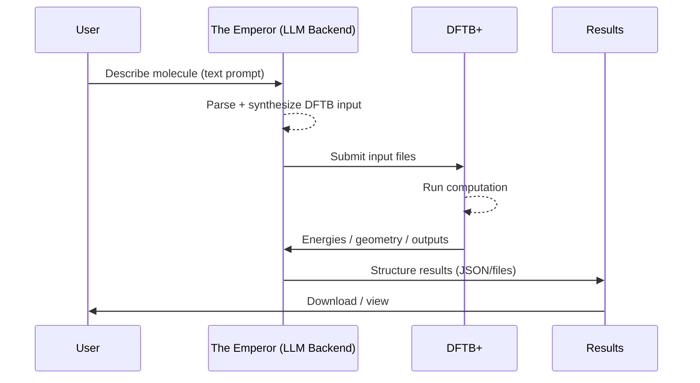

# 🌌 The Emperor (Backend)
Conversational computational chemistry.

The Emperor is a backend service designed to make computational chemistry more intuitive.
Instead of wrestling with input files, you simply describe the molecule you want. The system—powered by Large Language Models (LLMs)—translates natural language into precise DFTB+ inputs, ready for simulation.

Developed by Arif Akbarul Huda
Supervised by Prof. Dr. Yuniawan Hidayat, M.Sc.
## 📂 Project Structure
<hr>

```
Emperor-Backend
> app
> data
    > jobs
> parameters
    > mio-1-1
    > matsci-0-3
    > 3ob-3-1
```

### ⚙️ Requirement
First, install DFTB+ in your environment. For ubuntu :
```
wget https://www.dftbplus.org/fileadmin/DFTB-Plus/DFTBplus-24.1.x86_64-linux.tar.xz
tar -xf dftbplus-24.1.x86_64-linux.tar.xz
sudo mv dftbplus-24.1.x86_64-linux /opt/dftbplus
sudo ln /opt/dftbplus/bin/dftb+ /usr/local/bin/dftb+
```
Verify installation:
``` 
dftb+ --version
```
Then install Python dependencies:
``` 
pip install -r requirements.txt
```
Run the backend locally
```
uvicorn app.main:API --host 0.0.0.0 --port 8000 --reload
```

### 📜 Parameters Setup
<hr>

Download the required parameter sets from [DFTB Parameters](https://dftb.org/parameters/download.html). Go to the `parameters` directory then type :
```
wget https://github.com/dftbparams/matsci/releases/download/v0.3.0/matsci-0-3.tar.xz
tar -xvf matsci-0-3.tar.xz
```
Repeat for other parameter sets such as `3ob` and `mio`

### ☕ Workflow
<hr>

1. Describe your molecule in plain text. 
2. The Emperor generates the required input files. 
3. DFTB+ runs the computation. 
4. You review the results—all while your coffee stays warm.


### ✨ Vision
<hr>

1. The Emperor aims to bridge language and science:
2. Natural language interface for chemists and researchers. 
3. Reproducible, physics-grounded outputs for computational reliability. 
4. Scalable backend to integrate with larger research workflows.