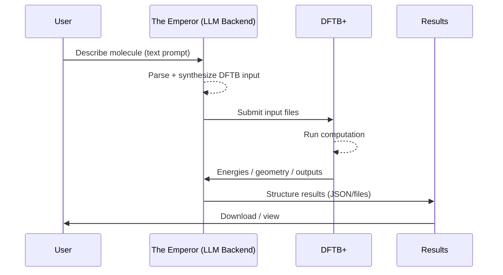

# 🌌 The Emperor (Backend)
Conversational computational chemistry.

The Emperor is a backend service designed to make computational chemistry more intuitive.
Instead of wrestling with input files, you simply describe the molecule you want. The system—powered by Large Language Models (LLMs)—translates natural language into precise DFTB+ inputs, ready for simulation.

Developed by Arif Akbarul Huda
Supervised by Prof. Dr. Yuniawan Hidayat, M.Sc.
## 📂 Project Structure
<hr>

```
Emperor-Backend
> app
> data
    > jobs
> parameters
    > mio-1-1
    > matsci-0-3
    > 3ob-3-1
```

### ⚙️ Requirement
First, install DFTB+ in your environment. For ubuntu :
```
wget https://www.dftbplus.org/fileadmin/DFTB-Plus/DFTBplus-24.1.x86_64-linux.tar.xz
tar -xf dftbplus-24.1.x86_64-linux.tar.xz
sudo mv dftbplus-24.1.x86_64-linux /opt/dftbplus
sudo ln /opt/dftbplus/bin/dftb+ /usr/local/bin/dftb+
```
Verify installation:
``` 
dftb+ --version
```
Then install Python dependencies:
``` 
pip install -r requirements.txt
```
Run the backend locally
```
uvicorn app.main:API --host 0.0.0.0 --port 8000 --reload
```

### 📜 Parameters Setup
<hr>

Download the required parameter sets from [DFTB Parameters](https://dftb.org/parameters/download.html). Go to the `parameters` directory then type :
```
wget https://github.com/dftbparams/matsci/releases/download/v0.3.0/matsci-0-3.tar.xz
tar -xvf matsci-0-3.tar.xz
```
Repeat for other parameter sets such as `3ob` and `mio`

### ☕ Workflow
<hr>

1. Describe your molecule in plain text. 
2. The Emperor generates the required input files. 
3. DFTB+ runs the computation. 
4. You review the results—all while your coffee stays warm.


### ✨ Vision
<hr>

1. The Emperor aims to bridge language and science:
2. Natural language interface for chemists and researchers. 
3. Reproducible, physics-grounded outputs for computational reliability. 
4. Scalable backend to integrate with larger research workflows.

<hr>

# The Emperor API — Endpoint Documentation

This document describes the REST endpoints exposed by **The Emperor (Backend)**.  
All endpoints are CORS-enabled (`*`) and return JSON unless otherwise noted.

- **Base URL (local dev)**: `http://localhost:8000`
- **Content types**: `application/json`, `multipart/form-data`
- **Auth**: none (development default)
- **Jobs workspace**: `data/jobs/<job_id>`
- **Parameters root**: `DFTB_PREFIX` env var (defaults to `./parameters`)
- **DFTB+ runtime**: `dftb+` must be available on `PATH` (symlinked or installed)

---

## Health & Introspection

### GET `/health`
Returns service status and discoverable parameter sets.

**Response 200**
```json
{
  "status": "ok",
  "DFTB_PREFIX": "/abs/path/to/parameters",
  "param_sets": ["mio-1-1", "matsci-0-3", "3ob-3-1"]
}
```

**cURL**
```bash
curl -s http://localhost:8000/health
```

---

### GET `/param-sets`
List available parameter set directories under `DFTB_PREFIX`.

**Response 200**
```json
{ "param_sets": ["mio-1-1", "matsci-0-3", "3ob-3-1"] }
```

**cURL**
```bash
curl -s http://localhost:8000/param-sets
```

---

## File Access

### GET `/file/{job_id}/{filename}`
Fetch a generated file from a job workspace.

- If the file extension is one of `{.log, .out, .txt, .hsd}` → **plain text** response.
- Otherwise → **file download** (binary).

**Path params**
- `job_id` — UUID returned from prepare endpoints
- `filename` — e.g., `dftb_in.hsd`, `out.log`, `detailed.out`

**Responses**
- `200 text/plain` or `200 application/octet-stream`
- `404` when job or file not found

**cURL (text)**
```bash
curl -s http://localhost:8000/file/<job_id>/out.log
```

**cURL (download)**
```bash
curl -OJ http://localhost:8000/file/<job_id>/geo_end.gen
```

---

## Prepare Geometry (POSCAR → DFTB+)

### POST `/prepare-poscar`
Validate a **VASP5 POSCAR** upload, derive species, generate `dftb_in.hsd`, and create a job.

**Form-data**
- `file` *(required, file)* — POSCAR text (VASP5 with symbols line)
- `param_set` *(optional, string; default: `mio-1-1`)* — must exist under `DFTB_PREFIX`

**Behavior**
- Validates POSCAR format with detailed, user-facing errors.
- Parses via ASE, builds **GenFormat** and **SlaterKosterFiles**.
- Infers **MaxAngularMomentum** per set (`3ob`, `mio`, `matsci`) and species.
- Creates a `parameters` symlink to `DFTB_PREFIX` inside the job folder.

**Response 200**
```json
{
  "job_id": "6c6a2a9d-0a2e-4cf1-8f04-1a6c7b1e1a0a",
  "prepared": true,
  "elements": ["H","O"],
  "species_order": ["O","H"],
  "param_set": "mio-1-1"
}
```

**Errors**
- `400` — missing/unknown `param_set`
- `400` — POSCAR validation errors (clear messages, e.g., counts mismatch)
- `415` — if file not provided (FastAPI validation)

**cURL**
```bash
curl -s -X POST http://localhost:8000/prepare-poscar   -F "file=@POSCAR"   -F "param_set=matsci-0-3"
```

---

## Prepare Geometry (GenFormat / HSD-wrapped / POSCAR text)

### POST `/prepare-genformat`
Normalize and prepare geometry provided as text:
- Accepts: raw **GenFormat inner block**, **full HSD with `Geometry = GenFormat {}`**, or **POSCAR-like text** (auto-detected).
- Produces `dftb_in.hsd` and saves normalized inputs.

**Form-data**
- `genformat` *(required, string)* — geometry text (see accepted forms above)
- `param_set` *(optional, string; default: `mio-1-1`)*

**Response 200**
```json
{
  "job_id": "f2a7f4e8-5a1f-4c8a-b3b0-9f2d1d3d1b0b",
  "prepared": true,
  "elements": ["C","H","O"],
  "species_order": ["C","O","H"],
  "param_set": "3ob-3-1",
  "detected_input": "genformat"
}
```

**Files written in `data/jobs/<job_id>`**
- `dftb_in.hsd` — runnable DFTB+ input
- `GENFORMAT.txt` — canonical GenFormat inner block
- `INPUT_RAW.txt` — original (de-fenced) text
- `parameters` → symlink to `DFTB_PREFIX`

**Errors**
- `400` — missing/unknown `param_set`
- `400` — malformed GenFormat/POSCAR (explicit messages)

**cURL**
```bash
curl -s -X POST http://localhost:8000/prepare-genformat   -F 'genformat=3 C

  C O H

  1 1  0.0 0.0 0.0
  2 2  0.0 0.0 1.2
  3 3  1.0 0.0 0.0'   -F "param_set=3ob-3-1"
```

---

## Run Simulation

### POST `/run/{job_id}`
Execute `dftb+` inside the job workspace that already contains `dftb_in.hsd`.

**Path params**
- `job_id` — from a previous *prepare* call

**Behavior**
- Re-creates `parameters` symlink if missing.
- Runs `bash -lc "dftb+ > out.log 2>&1"` with `timeout=1200s`.
- Success is inferred by presence of `detailed.out`.

**Response 200**
```json
{
  "job_id": "6c6a2a9d-0a2e-4cf1-8f04-1a6c7b1e1a0a",
  "ok": true,
  "rc": 0
}
```

**Errors**
- `400` — `prepare` not called yet (no `dftb_in.hsd`)

**cURL**
```bash
curl -s -X POST http://localhost:8000/run/<job_id>
```

---

## Fetch Results Summary

### GET `/results/{job_id}`
List files produced by the run and extract **Total Energy** from `detailed.out` if present.

**Response 200**
```json
{
  "job_id": "6c6a2a9d-0a2e-4cf1-8f04-1a6c7b1e1a0a",
  "files": [
    "POSCAR",
    "dftb_in.hsd",
    "detailed.out",
    "out.log",
    "geo_end.gen",
    "INPUT_RAW.txt",
    "GENFORMAT.txt",
    "parameters"
  ],
  "total_energy_Hartree": "-76.42012345"
}
```

> `total_energy_Hartree` is parsed from the line containing `"Total Energy:"` in `detailed.out` and may be `null` if not found.

**cURL**
```bash
curl -s http://localhost:8000/results/<job_id>
```

---

## Typical Workflow

1. **Check environment**  
   `GET /health` → confirm `DFTB_PREFIX` and parameter sets.

2. **Prepare a job**  
   - POSCAR route: `POST /prepare-poscar` (multipart)  
   - Text route: `POST /prepare-genformat` (multipart with `genformat`)

3. **Run DFTB+**  
   `POST /run/{job_id}`

4. **Inspect outputs**  
   - Summary: `GET /results/{job_id}`  
   - Logs/files: `GET /file/{job_id}/{filename}` (e.g., `out.log`, `detailed.out`, `dftb_in.hsd`)

---

## Validation Notes

- **POSCAR** must be **VASP5** style (symbols line on line 6), with numeric checks for lattice and coordinate lines.  
  Clear 400-level errors are returned for short files, counts/symbols mismatches, non-numeric coordinates, or missing *Direct/Cartesian* mode.

- **GenFormat** is normalized to a canonical inner block:
  ```
  N C
    <species...>

    i sid  x  y  z   (scientific notation)
  ```
  Duplicate or non-contiguous indices, invalid species ids, or malformed headers produce explicit 400 errors.

- **MaxAngularMomentum** is guessed per set:
  - `3ob-3-1`: H=s; C/N/O/F=p; P/S/Cl/Si=d
  - `mio-1-1`: H=s; others typically p (no d)
  - `matsci`: main-group as p; common transition metals as d  
  Unknown elements default to `p` (except H).

---

## Error Summary

| Status | When                                                                 |
|-------:|-----------------------------------------------------------------------|
| 400    | Unknown `param_set`; invalid POSCAR/GenFormat; missing `dftb_in.hsd` |
| 404    | Job not found; file not found                                        |
| 200    | Successful responses (JSON or file/plain text)                        |

---

## Environment & Runtime

- `DFTB_PREFIX` — absolute or relative path to parameter sets (default: `./parameters`)  
- `data/jobs/<job_id>` — per-job working directory  
- `timeout` for `dftb+` run: **1200s**  
- `dftb+` must be in `PATH` (e.g., symlink `/usr/local/bin/dftb+` → `/opt/dftbplus/bin/dftb+`)

---

## Minimal Client Snippets

**Python (requests) — prepare & run**
```python

# 1) prepare from POSCAR
resp = requests.post(
    "http://localhost:8000/prepare-poscar",
    files={"file": open("POSCAR","rb")},
    data={"param_set":"matsci-0-3"}
).json()
job_id = resp["job_id"]

# 2) run
run = requests.post(f"http://localhost:8000/run/{job_id}").json()

# 3) results
res = requests.get(f"http://localhost:8000/results/{job_id}").json()
print(res)
```

**Fetch a file**
```bash
curl -OJ http://localhost:8000/file/<job_id>/detailed.out
```